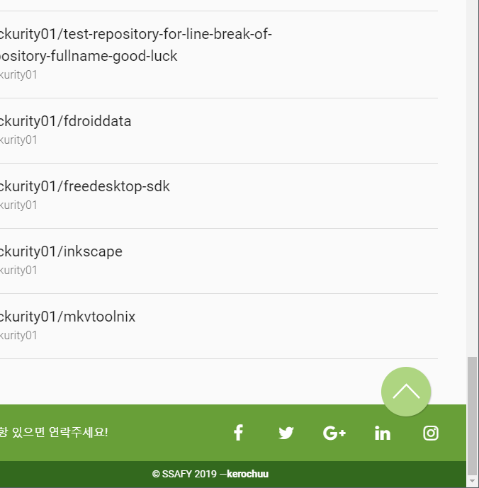

# ssafy

## Project setup
```
npm install
```

### Compiles and hot-reloads for development
```
npm run serve
```

### Compiles and minifies for production
```
npm run build
```


Req. 1-1 header, footer 구현


Req. 1-2 header 영역에 블로그 제목 노출 구현


Req. 1-3 스크롤시 헤더가 같이 움직이도록 구현


Req. 1-4 메인 이미지 영역이 새로고침시 마다 변경 되도록 구현


Req. 1-5 반응형 웹 사이트 구현
	모바일 사이즈에서 About Me 이미지 미노출
	모바일 사이즈에서 이미지 영역을 화면 사이즈로 고정
	모바일 사이즈에서 Home 화면의 About Me 텍스트 가운데 정렬
	가로 사이즈에 따라 텍스트 사이즈 자동 조절


Req. 1-6 반응형 웹 사이트 구현
	모바일 사이즈에서 4행 1열 노출로 변경
	태블릿 사이즈에서 2행 2열 노출로 변경(temp)


Req. 1-7 Portfolio 클릭시 페이지 이동을 구현


Req. 1-8 PortfolioWriter 페이지 구현 X

Req. 1-9 네비게이션 로고를 누르면 Home 화면으로 이동 구현

Req. 1-10 모바일 사이즈에서 3단 바 네비게이션 아이콘 구현 X


Req. 1-11 사이드 바의 메뉴를 클릭 시, 각 페이지로 이동 구현

Req. 1-12 자신의 블로그 정보 커스터마이즈

Req. 1-13 favicon 변경 구현


Req. 1-14 코드 레벨 네비게이션 영역을 Header 컴포넌트로 분리


Req. 1-15 포트폴리오, 포스트 리스트에서 타이틀은 한 줄, 설명은 3,4 줄 표시로 구현

Req. 1-16 git 레포지토리 이름이 개행되지 않도록 설정

Req. 1-17 페이지 스크롤 시 페이지 최상단으로 이동 버튼 추가 구현



Req. 1-18 즐겨찾기에 추가하기 버튼을 제작 및 포트폴리오 사이트를 즐겨찾기로 등록하는 기능 추가


Req. 1-19 구글 크롬 외의 브라우저로 접속시 "해당 사이트는 크롬에 최적화 되어 있습니다." 라는 메시지 구현